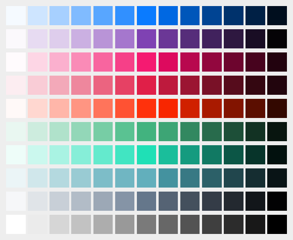

# Coloraiz.css
This is a sass/scss library, pre-compiled in a single .css file with a class for every color shade. In this guide you'll learn how to implement in your projects, so.. let's start coding!

<h2>Available colors:</h2> 
- Blue
- Purple
- Light Red
- Pink
- Orange
- Green
- Marine
- Azure
- Light Gray
- Gray (includes White & Black)



<h2>Why Colorize?</h2>
What <strong><a href="https://github.com/webeproject/Coloraiz.css">Coloraiz</a></strong> wants to do is semplify the color selection, so we added 13 shades for every colors. Shades are structured with numbers, ranging from 1 to 13 (from lighter to darker) 

Here the list with sample classes: 
```html
.cz .$colorname-1
.cz .$colorname-2
.cz .$colorname-3
.cz .$colorname-4
.cz .$colorname-5
.cz .$colorname-6
.cz .$colorname-7
.cz .$colorname-8
.cz .$colorname-9
.cz .$colorname-10
.cz .$colorname-11
.cz .$colorname-12
.cz .$colorname-13
```

So as you can see there is a prefix class before every $colorname and next there is the number of the shade.

##Download
To get <strong><a href="https://github.com/webeproject/Coloraiz.css">Coloraiz</a></strong> you can get it directly <a href="https://github.com/webeproject/Coloraiz.css">here</a> on GitHub or from our <a href="http://coloraiz.webe.io">website</a>
next you only need to link it in your page like a normal stylesheet
```html
<link link rel="stylesheet" href="../coloraiz/coloraiz.css" >
```
or you can use a mini rawgit dev CDN
```html
<link link rel="stylesheet" href="https://rawgit.com/webeproject/Coloraiz.css/master/Coloraiz/coloraiz.min.css" >
```

##Usage
<strong><a href="https://github.com/webeproject/Coloraiz.css">Coloraiz</a></strong> is so fast,
to assign a color you just add the corresponding class with its shade

```html
<!-- General html -->
...
<div>
  <h1 class="cz azure-7">This title is Azure</h1>
  <p class="cz purple-7"> and this text Purple</p>
</div>
```
also if you want color the background of the <code>div</code> you simply add the <code>.bg</code> class to it
</div>

```html
<!-- Background html -->
...
<div class="cz gray-3 bg"> <!-- i add the class to the div -->
  <h1 class="cz azure-7">This title is Azure</h1>
  <p class="cz purple-7"> and this text Purple</p>
</div>
```
